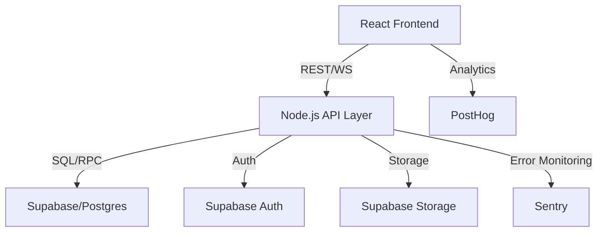

# Nexus Platform Database Schema

This repository contains the database schema for the Nexus Platform - an all-in-one creative and strategic operations platform powered by Echo AI.

## Schema Overview

The database schema is organized into several key areas:

### Core Tables

- **Users & Authentication**: User accounts, profiles, and subscription management
- **Content Management**: Content items, projects, and timeline clips
- **AI Models & Workflows**: AI model definitions and workflow templates

### Echo AI

- **Learning System**: User interactions tracking, pattern recognition, and insights generation
- **Personalization**: User preferences and style profiles

### Marketplace

- **Items & Purchases**: Marketplace items, reviews, and purchase records
- **Collections & Wishlists**: Curated collections and user wishlists

### Social Media Management

- **Accounts & Posts**: Connected social accounts and scheduled posts
- **Campaigns & Calendars**: Social media campaigns and content calendars
- **Analytics & Listening**: Performance tracking and social listening

### Analytics

- **Dashboards & Widgets**: Custom analytics dashboards and visualization widgets
- **Reports & Metrics**: Scheduled reports and stored metrics

### Support Center

- **Knowledge Base**: Articles, categories, and user feedback
- **Community Forum**: Questions, answers, and community engagement
- **Support Tickets**: User support requests and conversations

## Security

The schema implements comprehensive security using Supabase Row Level Security (RLS):

- Each table has appropriate RLS policies
- Data access is restricted based on ownership
- Role-based permissions for different user types

## Installation

1. Create a new Supabase project
2. Run the migration files in the following order:
   - `create_initial_schema.sql`
   - `add_echo_ai_schema.sql`
   - `add_marketplace_schema.sql`
   - `add_analytics_schema.sql`
   - `add_social_media_schema.sql`
   - `add_support_schema.sql`

## Local Development: Database Seeding

After running `supabase db reset`, you can seed your local database with initial data:

```
npm run seed
```

This will execute `supabase/seed.sql` using the Supabase CLI. Edit `supabase/seed.sql` to add or update your seed data as needed.

- The seed script is safe to run multiple times (uses `on conflict do nothing` for idempotency).
- For creating test users, use the Supabase dashboard or authentication API, not direct SQL.

## Automated User Creation

To create test users in your local Supabase instance, run:

```
npm run seed:users
```

This uses the Supabase Admin API and requires `SUPABASE_SERVICE_ROLE_KEY` in your `.env` file. The script will create users and you can then link their UUIDs in `supabase/seed.sql` for workspace memberships.

- After running `seed:users`, check the output for user UUIDs and update `workspace_memberships` in `seed.sql` if needed.
- You can automate this further by extending the user seed script to insert memberships via the API.

## One-Step Local Setup

To fully reset, seed, and test your local database and users in one step, run:

```
npm run dev:setup
```

This will:

- Reset the Supabase database (`supabase db reset`)
- Seed all tables and demo content
- Create users and assign workspace memberships
- Run your test suite to verify everything is working

You can also use the alias:

```
npm run devsetup
```

If any step fails, the script will stop and print an error.

## Developer Onboarding & Troubleshooting

### Onboarding

- Clone the repo and copy `.env.example` to `.env`, filling in your Supabase keys.
- Run `npm install` to install dependencies.
- Run `npm run dev:setup` to reset, seed, and test your local environment.
- Start the dev server with `npm run dev`.

### Troubleshooting

- If you see database errors, ensure Docker is running and Supabase CLI is installed.
- If tests fail, check your `.env` values and that the database is seeded.
- For lint/type errors, run `npm run lint` and `npm run typecheck` for details.

### Scripts

- `npm run lint` — Check code style and errors
- `npm run format` — Auto-format code
- `npm run typecheck` — TypeScript type checking
- `npm run test` — Run all tests
- `npm run dev:setup` — Full local reset, seed, and test

## API & Architecture Documentation

### API Endpoints

- Document your REST/GraphQL endpoints here, including authentication and workspace logic.
- Example:
  - `POST /api/login` — Authenticates a user
  - `GET /api/workspaces` — Lists workspaces for the current user

### Data Models

- Document your main tables and relationships (users, workspaces, memberships, etc.)

### Architecture

- Briefly describe your frontend, backend, and Supabase integration.
- Add diagrams if helpful.

### Secrets Management

- Use `.env` for local/dev, and GitHub Actions secrets for CI/CD.
- Never commit real secrets to version control.

### Production Readiness

- Add stricter config validation in your app for production.
- Integrate error monitoring (e.g., Sentry) in production builds.

## API Reference

### Auth

- `POST /api/login` — Authenticate user
- `POST /api/signup` — Register new user

### Workspaces

- `GET /api/workspaces` — List workspaces for current user
- `POST /api/workspaces` — Create workspace
- `GET /api/workspaces/:id` — Get workspace details

### Users & Roles

- `GET /api/users` — List users (admin only)
- `POST /api/users/:id/role` — Change user role (admin only)

---

## Architecture Diagram



---

## Entity Relationship Diagram

[View the ERD diagram](https://dbdiagram.io/d/nexus-platform-schema)

## License

This schema is proprietary and confidential.
